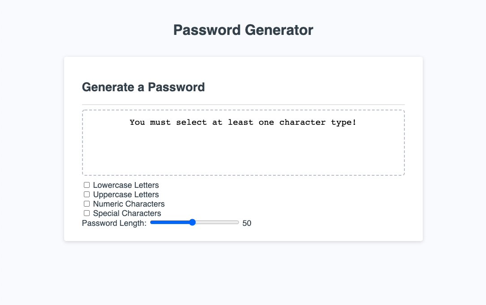

# Password Generator
This web application automatically generates secure random passwords based on user inputs including length and whether or not to include lower case letters, upper case letters, numeric characters, and special characters.

## Screenshot
[View the deployed web application.](https://dandandanoneil.github.io/password-generator/index.html)

## Next Steps
I'm interested in developing this web application further in the following ways:
 - Including other options like eliminating easily misread or confused characters like 0, O, 1, I, l, etc.
 - Adding a dropdown list of recently geenrated passwords
 - Updating or replacing the CSS to make the design/layout more my own

> Written with [StackEdit](https://stackedit.io/).