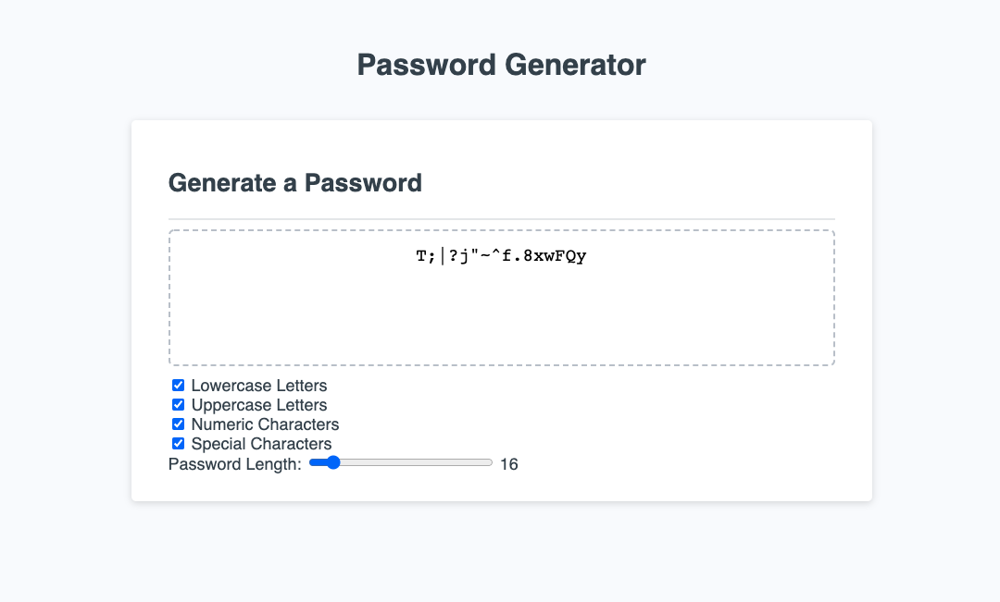
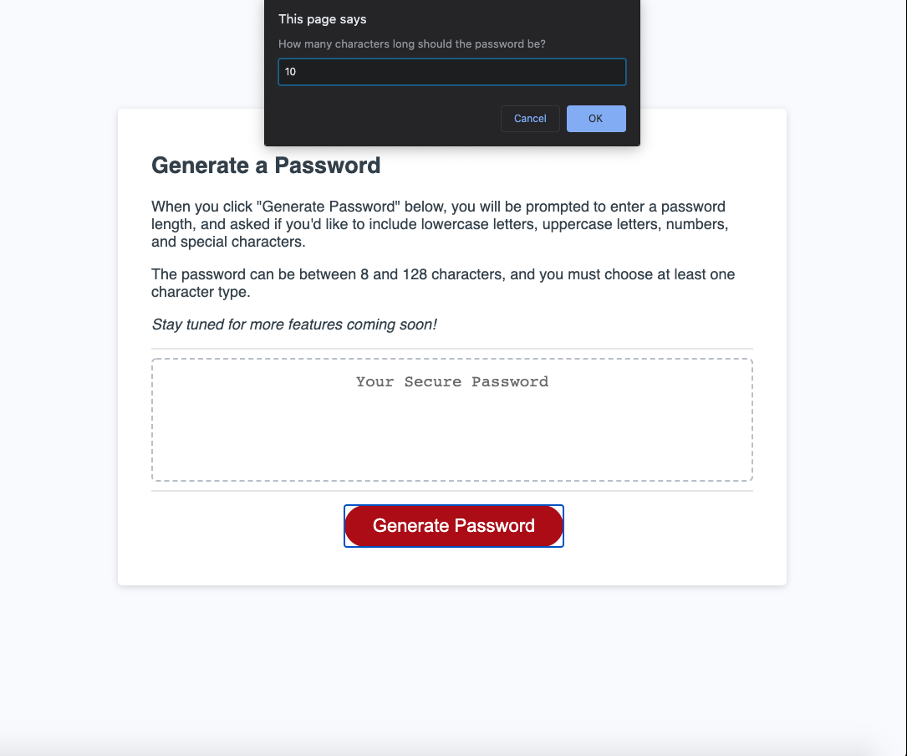

# Password Generator
This web application generates random passwords based on user inputs including length and whether or not to include lower case letters, upper case letters, numeric characters, and special characters.

For this assignment, I was given an HMTL file, CSS stylesheet, and barebones JavaScript file - most of my edits and additions are to script.js.

## Screenshot
[View the deployed web application.](https://dandandanoneil.github.io/password-generator/index.html)

Main Screen:

User Prompt Example:

## Next Steps
I'm interested in developing this web application further in the following ways:
 - Switching from 'prompt' and 'confirm' user inputs to a dropdown menu or range input slider for the password length and checkboxes/toggles for the character types
 - Including other options like eliminating easily misread or confused characters like 0, O, 1, I, l, etc.
 - Updating or replacing the CSS to make the design/layout more my own

> Written with [StackEdit](https://stackedit.io/).