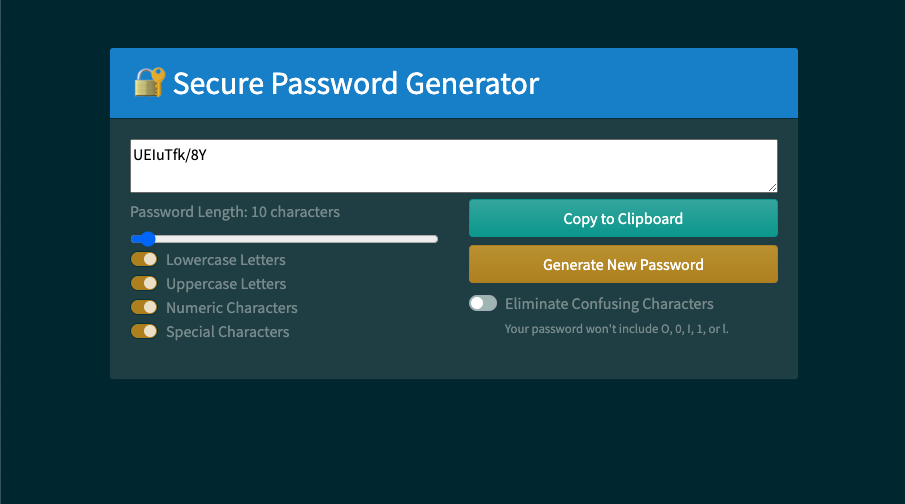

# Password Generator
This web application automatically generates secure random passwords based on user inputs including length and whether or not to include lower case letters, upper case letters, numeric characters, and special characters.

Other features include copying the generated password to the clipboard, generating a new password with the same criteria, and an option to eliminate easily misread characters (like 0, O, 1, I, and l).

## Screenshot
[View the deployed web application.](https://dandandanoneil.github.io/password-generator/index.html)

## Next Steps
I'm interested in developing this web application further in the following ways:
 - Adding a dropdown list that retrieves recently geenrated passwords
 - Updating or replacing the CSS to make the design/layout more my own

> Written with [StackEdit](https://stackedit.io/).